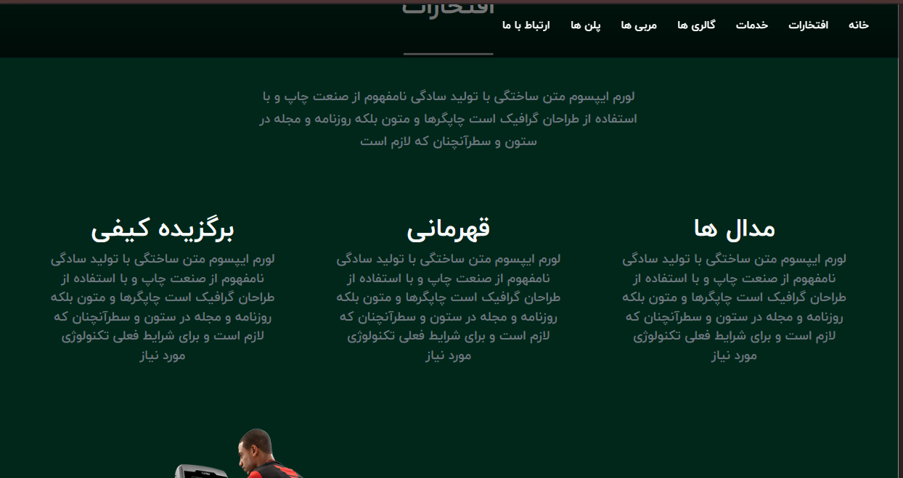
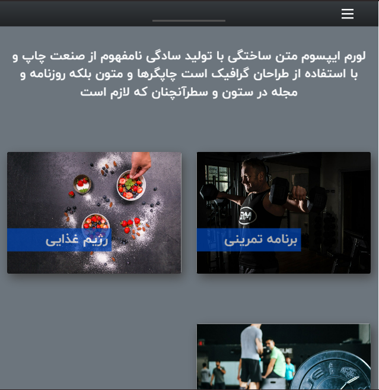
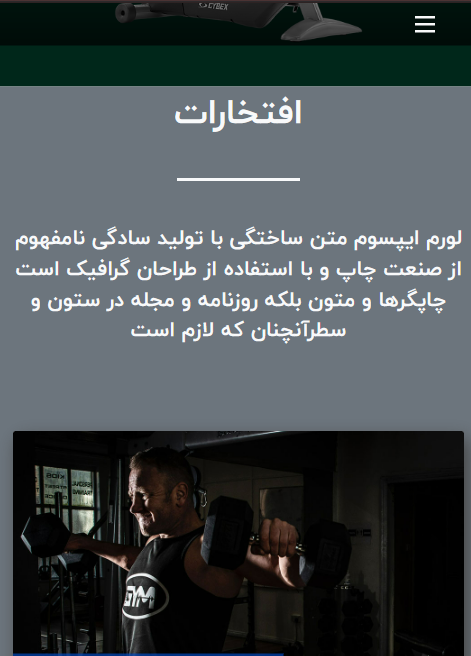

# Gym Project

[](https://github.com/sajjad-sisakhtpour/gym/blob/main/LICENSE)
[](https://github.com/sajjad-sisakhtpour/gym/stargazers)
[](https://ir.linkedin.com/in/sajad-sisakht-pour)

## Overview

The Gym project is a sample web application designed to showcase modern web development practices. This project was created to demonstrate front-end skills, including responsive design, interactivity, and animation. It features a user-friendly interface with engaging animations and smooth transitions, ideal for fitness-related websites. The goal is to provide a platform where users can explore gym plans, book memberships, and get in touch with trainers.

## Features

- **Responsive Design**: Adaptable to different screen sizes for a seamless experience.
- **Smooth Animations**: Engaging animations throughout the site for an interactive user experience.
- **Modern UI**: Clean, professional look using CSS and HTML5.
- **Interactive Navbar**: Dynamic menu with smooth transitions and animations.

## Prerequisites

Before you begin, ensure you have met the following requirements:
- A modern web browser (Chrome, Firefox, Safari, etc.)
- A text editor (Visual Studio Code, Sublime Text, etc.)
- Node.js and npm (if needed for advanced usage or server setup)

## Installation

Follow these steps to install the project:

1. **Clone the repository**:
   ```bash
   git clone https://github.com/sajjad-sisakhtpour/gym.git
   ```

2. **Navigate into the project directory**:
   ```bash
   cd gym
   ```

3. **Install dependencies (if applicable)**:
   ```bash
   npm install
   ```

4. **Open the project in your browser**:
   - Simply open the `index.html` file in any modern browser to view the project.

## Usage

This project is fully functional out of the box. To view the site:

1. Open `index.html` in your browser.
2. Use the navbar to navigate between sections, explore the gym plans, and check out the services offered.

## Screenshots

Here are some screenshots of the project:

- 
- 
- 

## Live Demo

Check out the live demo of this project here: [Live Demo](https://your-demo-link.com)

## Documentation

For detailed documentation on how to use this project and its features, refer to the `docs/` folder, or contact the project maintainer.

## Contributing

We welcome contributions to the Gym project! If you'd like to contribute, please follow these steps:

1. Fork the repository.
2. Create a new branch (`git checkout -b feature-name`).
3. Make your changes and commit them (`git commit -m 'Add new feature'`).
4. Push to your branch (`git push origin feature-name`).
5. Open a pull request.

## License

This project is licensed under the MIT License - see the [LICENSE](https://github.com/sajjad-sisakhtpour/gym/blob/main/LICENSE) file for details.

## Contact

- **Email**: [sajjad.sisakhtpour@gmail.com](mailto:sajjad.sisakhtpour@gmail.com)
- **GitHub**: [github.com/sajjad-sisakhtpour](https://github.com/sajjad-sisakhtpour)
- **LinkedIn**: [ir.linkedin.com/in/sajad-sisakht-pour](https://ir.linkedin.com/in/sajad-sisakht-pour)

---

Made with ❤️ by **Sajjad Sisakhtpour** - [GitHub](https://github.com/sajjad-sisakhtpour) | [LinkedIn](https://ir.linkedin.com/in/sajad-sisakht-pour)